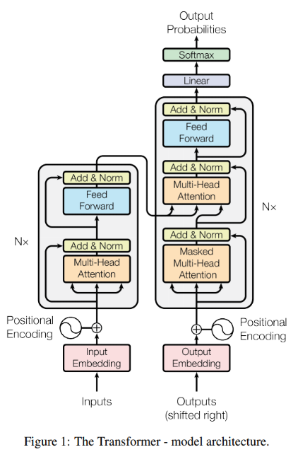

# Pytorch NLP
Pytorch 트랜스포머 및 언어모델 구현

## Transformer


```python
class Transformer(nn.Module):

    def __init__(self, src_pad_idx: int, trg_pad_idx: int, enc_voc_size: int, dec_voc_size: int, d_model: int, n_head: int, max_len: int,
                ffn_hidden: int, n_layers: int, drop_prob: float, device: str) -> None:
        super(Transformer, self).__init__()

        self.src_pad_idx = src_pad_idx
        self.trg_pad_idx = trg_pad_idx
        self.device = device

        self.enc_embedding = TransformerEmbedding(d_model=d_model,
                                                seq_length=max_len,
                                                vocab_size=enc_voc_size,
                                                drop_prob=drop_prob,
                                                device=device)

        self.dec_embedding = TransformerEmbedding(d_model=d_model,
                                                seq_length=max_len,
                                                vocab_size=dec_voc_size,
                                                drop_prob=drop_prob,
                                                device=device)

        self.encoder = Encoder(d_model=d_model,
                               ffn_hidden=ffn_hidden,
                               n_head=n_head,
                               n_layers=n_layers,
                               drop_prob=drop_prob,
                               device=device
                               )
        
        self.decoder = Decoder(d_model=d_model,
                               ffn_hidden=ffn_hidden,
                               n_head=n_head,
                               n_layers=n_layers,
                               drop_prob=drop_prob,
                               device=device
                               )
        
        self.linear = nn.Linear(d_model, dec_voc_size)

    def make_src_mask(self, src: Tensor) -> Tensor:

        src_mask = (src != self.src_pad_idx).unsqueeze(1).unsqueeze(2)

        return src_mask
    
    def make_trg_mask(self, trg: Tensor) -> Tensor:
        
        trg_pad_mask = (trg != self.trg_pad_idx).unsqueeze(1).unsqueeze(2)
        
        trg_len = trg.shape[1]
        
        trg_sub_mask = torch.tril(torch.ones((trg_len, trg_len), device = self.device)).bool()
            
        trg_mask = trg_pad_mask & trg_sub_mask
        
        return trg_mask

    def forward(self, src: Tensor, trg: Tensor) -> tuple:

        src_mask = self.make_src_mask(src)
        trg_mask = self.make_trg_mask(trg)

        src = self.enc_embedding(src)
        enc_src = self.encoder(src, src_mask)

        trg = self.dec_embedding(trg)
        output, attention = self.decoder(trg, enc_src, trg_mask, src_mask)

        output = self.linear(output)
        
        return output, attention
```

## Ko-En Translation
+ Pytorch 로 구현한 Transformer 를 활용하여, 한글-영어 번역 모델 학습
1. 학습 데이터 준비
    - AI Hub 한국어-영어 번역(병렬) 말뭉치 (https://aihub.or.kr/aidata/87)
    - transformer/data/kor_eng_transform 디렉토리에 학습용 엑셀 데이터 추가 (ex. 1_구어체(1).xlsx)
2. 학습 Config 설정

3. 학습
```python
python train_translation.py
```
4. 추론
```python
python translation.py
```

```
input_str : 은행으로 가는 버스는 어디서 타야 하나요?

top_3 -> beam search results =============================
Where should I take a bus to go to the bank?
Where do I have to take a bus to the bank?
Where should I take the bus to the bank?

greedy search result =============================
Where do I have to take a bus to the bank?
```


# To-do
- Transformer attention visualization
- 평가 로직 구현
- BERT 구현 및 학습

# References
 - https://colab.research.google.com/github/metamath1/ml-simple-works/blob/master/transformer/annotated_transformer.ipynb
 - https://github.com/hyunwoongko/transformer
 - https://github.com/bentrevett/pytorch-seq2seq
 - https://github.com/nawnoes/pytorch-transformer